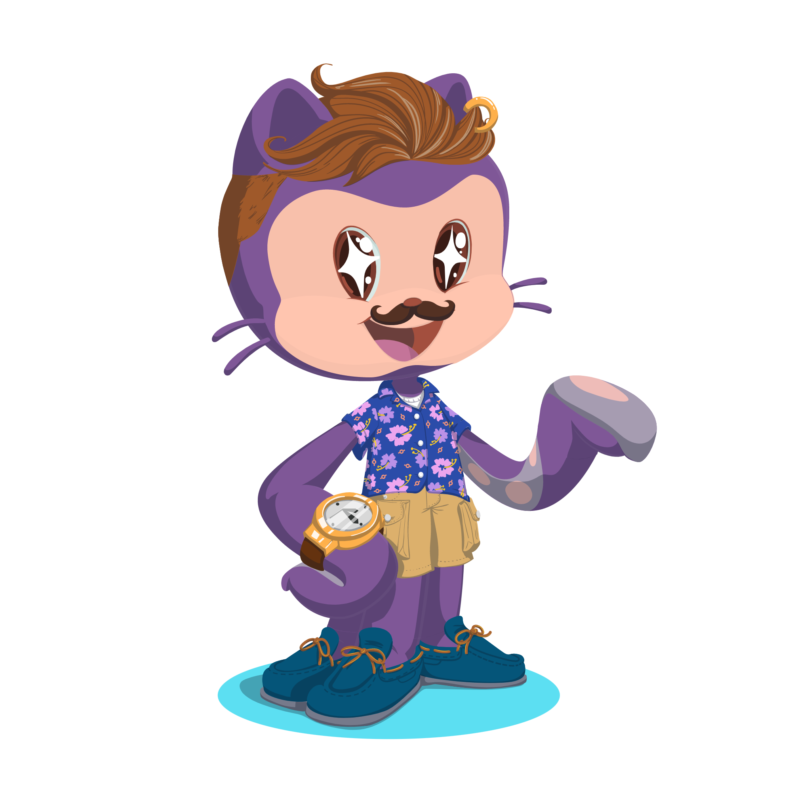

&nbsp;

 
 

<h1 align="justify">React: gerenciando estado com Recoil</h2>
<h2 align="justify">Feito por : Thiago Zambelli</h2>

 
  

- [Projeto](#projeto)
- [Aulas](#aulas)
- [Problemas e Soluções](#problemas-e-soluções)
- [Material do Projeto inicial](#material-do-projeto-inicial)

&nbsp;

---

&nbsp;

# Projeto -> 

---

## Recoil:
>Lib utilizada para gerenciamento dos estados locais. `nmp i recoil`

---

&nbsp;

# Problemas e Soluções -> 

---

## Regras dos hooks:

- Apenas chame Hooks no nível mais alto. Não chame Hooks dentro de loops (for, foreach, while), condições (if, else if) ou funções aninhadas (por exemplo, numa função que é executada dado um evento de onClick).
- Apenas chame Hooks a partir de componentes funcionais. Não chame Hooks a partir de funções comuns, fora de componentes React.

> A [documentação](https://pt-br.reactjs.org/docs/hooks-rules.html) é sempre uma excelente fonte de conhecimento, aproveite ao máximo.

---

&nbsp;

# Aulas -> 

---
## Aula 1

- Analisar e entender código que outras pessoas desenvolveram
  - O dia a dia de pessoas desenvolvedoras requer muita leitura de código, e não somente escrever coisas novas.
- Criar atoms
  - Átomos são as porções que compõem o estado compartilhado do recoil.
- Acessar atoms
  - Nós utilizamos o hook useRecoilValue para ter acesso à lista de eventos.
- Modificar atoms
  - Nós utilizamos o hook useSetRecoilState para adicionar novos itens à lista de eventos.